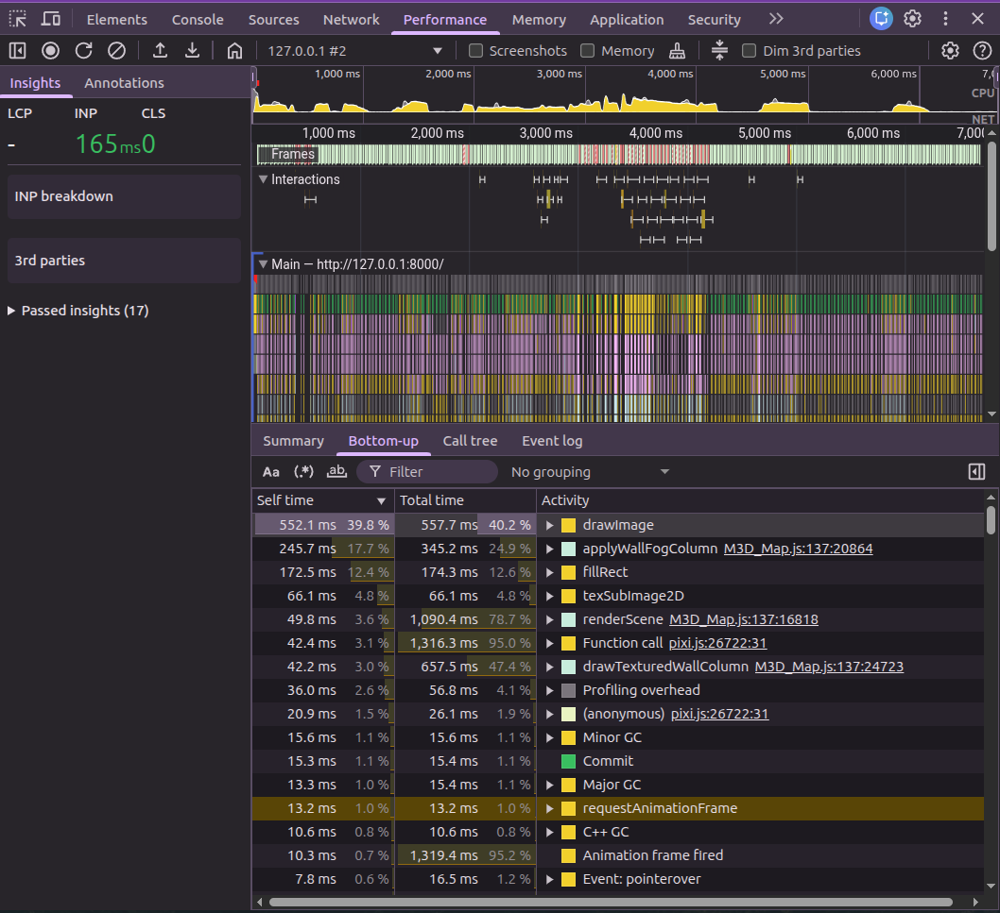
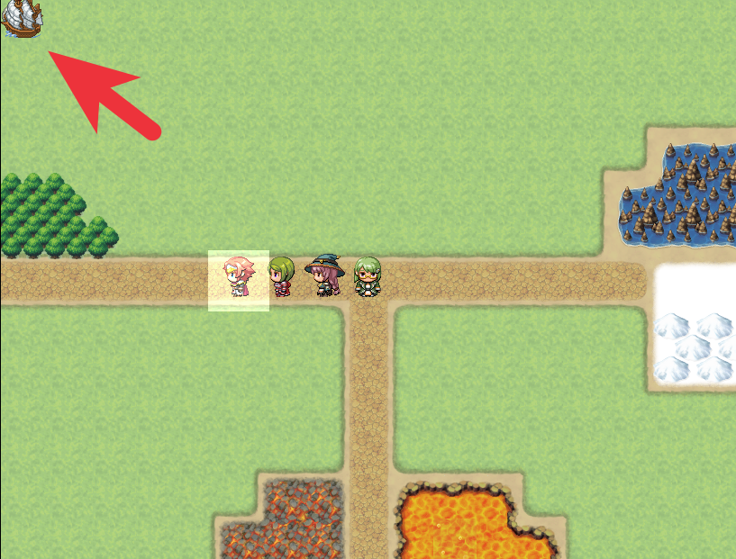
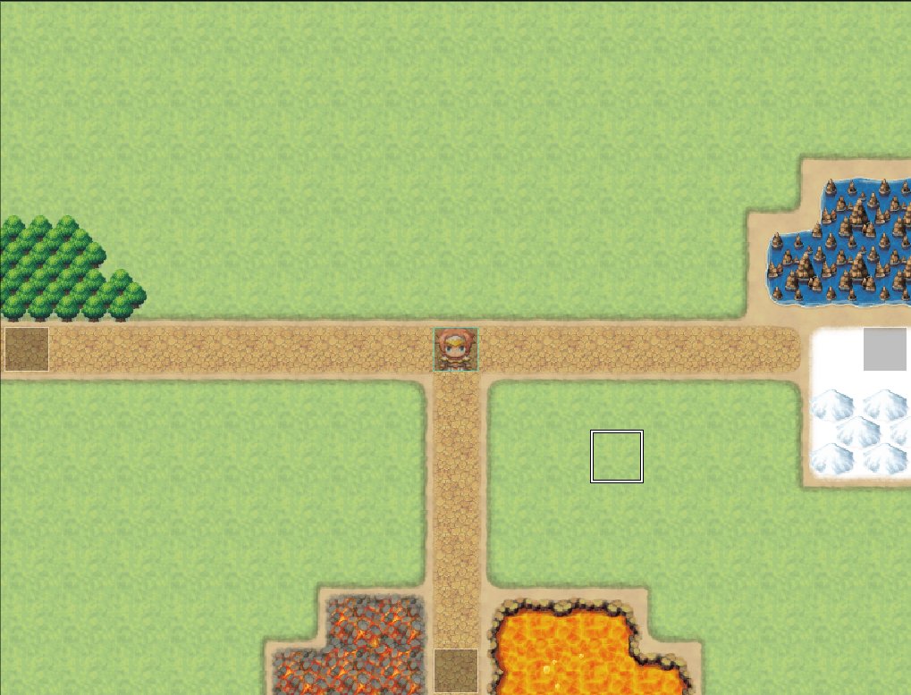
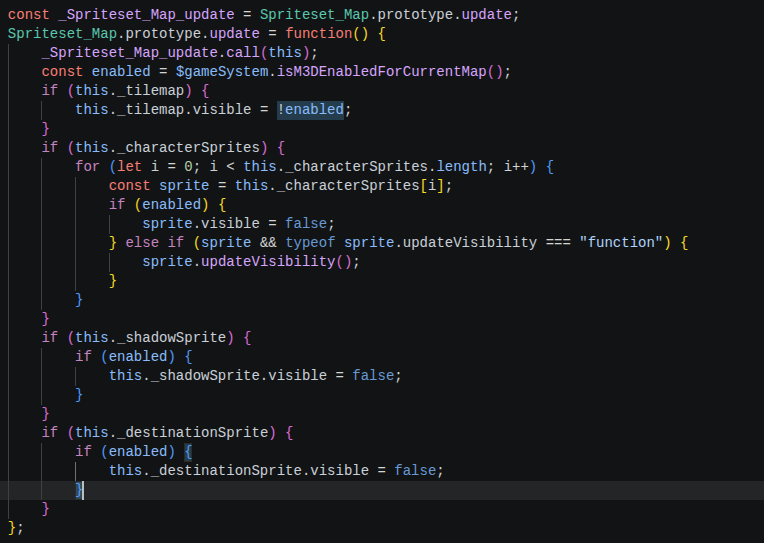

## 前言

M3D 是一個給 RPG Maker MV 使用的第一人稱 3D 地圖插件，目標很直接：
> 讓原本的 2D 地圖可以用第一人稱方式走進去。

但「把畫面變成 3D」只是開始。  
真正花時間的，往往是那些看起來不應該困難的事情，包含但不限於：
- 一面牆應該畫在哪裡
- 地板跟方塊頂面貼圖爲什麼會把 FPS 幹到剩不到 5
- 低矮方塊的頂面為什麼會穿牆

## 早期開發

### 傳統單檔開發模式

早期的 M3D 主要依賴 Canvas 2D。  
它雖然不是最理想的渲染方式，但至少能正常進入地圖、處理玩家移動，也有一套已經驗證過的迷霧與牆面繪製邏輯。

由於當時還在概念驗證階段，以及我注意到 RM 圈仍有很多人是單檔開發，我想入境隨俗，所以就在 ES5 的語法環境下硬幹出一個勉強能用的東西。

然而，單一檔案很快膨脹到超過 70KB。  
所有事情都混在一起：
- RMMV 的資料
- raycast
- 投影
- 貼圖
- 迷霧
- 最後把東西畫到畫面上的程式碼
- 等等...

繼續在同一個檔案裡加功能，速度會越來越慢，也越來越不敢改動舊邏輯。



於是，我把整個專案以 `TypeScript` 改寫，並以功能性拆成多檔，以 `Vite` 打包，並加入版本控制，時爲 `v0.3`。



### 改寫後首次碰壁 

就當我以爲一切都能舒服地開始後，沒過多久，第一個考驗就來了。

我在內部版本迭代至 `v0.3.11` 時發現，當我嘗試繪製地板與方塊頂面的貼圖時，本來就不樂觀的 FPS 會直接崩到難以操作（約 30 fps -> 5 fps）

而且，卡就算了，那個方塊頂面繪製還沒辦法對齊，甚至還能隔著牆壁看到那堆頂面。

因此我在該版本標示了：
> 確定不支援 floor-casting，刪除無用的頂面繪製，將地面改回純色設計

這個問題暫時先裝沒看到（因爲只要方塊夠高，玩家就看不到頂面），先專注在其他細節的開發。

### 插曲 

如果你有看上面那個影片的話，可能會注意到影片一開始的地圖，左上角有不明物體。

當我拿著這個問題去群組問後，瞬間引來衆多大佬www

不過最終是在有人||偷||用[[現代科技|AI]]的情況下才找出問題：


簡單說就是，RMMV 在載入地圖後預設一定會生成 3 個交通工具的圖層。  
平時這些圖層的邏輯是「如果沒有放在地圖上，或者處於透明」就把 `visible` 設定爲 `false`。  


但是當時我對 RMMV 其實不瞭解，我完全不知道有這個機制，在插件裡天真地對所有圖層的 `visible` 動手腳，這導致未啓動 M3D 的地圖才出現那些奇怪的圖層。

好在修正也很簡單：

後來有其他前輩陸續感慨：
> 不過我真沒想到是隱藏耶，我以為這種東西沒生成的時候就不該出現在地圖上

> 挖 一想到自己的地圖原來平常就藏著交通工具 感覺真新奇

~~看來我憑一己之力就捅出前輩們從來沒看過的 bug 呢 :D~~

不過也因爲這次事件，讓我思考，該如何在開發流程中藉助 AI 的能力，避免未來再發生這種事...

### 實作自由移動

由於 RMMV 原生設計，玩家操作都是在格子座標系上移動的。  
這本不是問題，但是如果把視角放到 3D 上，那操作起來就非常詭異了。

因此，我把 3D 場景的玩家移動改成自由移動（連續座標系）。  
只是爲了相容 RMMV 地圖，我保留了格子座標系的近似值。

這樣一來，後續要增加跳躍、蹲下、甚至是即時戰鬥系統，看起來會更加符合直覺。

||雖然寫文章的當下，上述沒有一樣是完成的，哈哈哈哈~||

## 嘗試以 WebGL 重寫整個渲染架構

### 開始前的約法三章

老實說，我是一個思維很守舊的人。  
尤其面對當今 AI 浪潮，我經常因爲各種因素而沒辦法接受 AI 協助 coding 這件事。

但在這裡我遇到從來沒碰過的領域：WebGL。   
爲了打鐵趁熱，爲了即將到來的 [RME 2026 Summer](https://itch.io/jam/rm-event-2026-summer)，我不得不改變我的思維，嘗試在我的工作流程中導入 AI：
- 我選擇 Codex，因爲我剛好有訂閱 ChatGPT Plus，用它就不用再額外花錢了。  
- 我選擇把 Codex 當成什麼都會而且能即時回應的顧問，並且讓它給我早期拓荒的概念驗證範例。  
- 在一定限制下，Codex 可以作爲「程式碼 -> 文件」的好幫手；  
如果我還像以前那樣堅持自己寫，那就是不知變通了。
- 在出階段成果前，可以用 Codex 掃一遍專案，避免有什麼地方寫壞，或者有潛在問題。

### 重寫前的最後掙扎

我必須得說，Canvas 轉成 WebGL，這工程量之大真的不是開玩笑的。  
所以即使我相對不排斥重構，但還是有點怕。  
而這份畏懼，體現在重寫前的效能改善嘗試。

這段時間，我嘗試合成牆面貼圖，也就是把原本的「每格貼圖都各自畫一次」，改成「算好柱子多高，反正每格都重複，不如一次批量畫好」。  
因此我建立了常規柱面的快取功能，用圖塊 ID 與高度資訊作爲快取的 Key。  
只要相同的柱子與高度已經處理過，後續就可以從快取拿，而不用重新繪製。

這個改動把原本的 30 fps 直接升到 60 fps，效果好到一度令我懷疑是不是可以繼續龜在 Canvas 不搬家？但很快我就想清楚，目前的高效能基於的是沒有地板與方塊頂面繪製，未來 M3D 想做更好，這功能絕對不能欠缺。

想到這裡，其實我也認命了。  
該面對的終要面對，否則這終究是只能自娛自樂的插件而已，這和我未來想在功能完善後公開原始碼的理念相悖。  
而且這次嘗試不全然是徒勞，它讓我知道真正加速的不是 WebGL，不是說轉過去就有魔法一步到位，後續必然要加上多種最佳化。  

### 不要重複撞牆

M3D 這個插件並不是傳統意義上的插件，它更像是一個渲染引擎，只是包裝成 RMMV 相容的樣子ww  
而圖形渲染引擎在開發時最痛苦的是：

> 東西都能跑，但是視覺看起來是錯的，操作起來是不順暢的，偶爾還會有奇怪閃爍...

爲了避免重蹈早期用 Canvas 的無頭蒼蠅式除錯，這回我打算在遷移初期先做好除錯工具，而不是直接接管整個渲染畫面。

這裡我優先處理牆面跟迷霧從 Canvas 逐步搬到 PIXI / WebGL。  
但是不能直接把 Canvas 刪掉。Canvas 是已經驗證過的可行方案，保留它可以更好地驗證新建的渲染器可以正確接管相應功能。  



因此，我先後加入多個除錯入口，這分別表示不同渲染模式：
- [[`pxw`|wire]]: 只看牆柱幾何輪廓
- [[`pxs`|solid]]: 用純色確認牆柱位置與高度
- [[`pxt`|textured]]: 加入實際牆面貼圖

這三種模式是依序誕生的。  
先確認幾何，再確認顏色，最後才確認貼圖。  
這樣的流程可以最大程度地避免所有東西都混在一起，導致出錯時不知道鍋歸何家。

同時，PIXI 先以獨立的覆蓋層級，Canvas 仍然負責主畫面。  
這讓每次嘗試都能快速開關，也確保實驗失敗時可以回到原本可用的渲染模式。

當上述渲染模式穩定後，我把它整合成：
- [[`pxm`|mixed]]: 讓 PIXI / WebGL 接手牆面主輸出  

此時由 `pxm` 模式渲染的畫面已經跟 Canvas 的視覺效果高度雷同，只是效能還有待改進，因此我在這裡設定**第一個基線**，後續嘗試的渲染模式必須比這個效能還高才會被納入正式候選名單。

### 進一步改善... 但是失敗了

上面 `pxm` 完成後，我用 Performance 監測了畫面渲染的最耗性能的兇手，發現 CPU 在計算迷霧距離與混色時，耗時相當大。  
因此這節的重點在於改善這個問題。

這段期間加入了這個模式：
- [[`pxq`|single column quad + fragment shader]]: 讓着色器處理貼圖、透明區域、側面亮度、迷霧。  
  這個模式的優點是概念很直接，所以算是導入着色器的概念驗證。

上述 `pxq` 是一個分水嶺。  
因爲從這裡開始就要自訂着色器了，這意味著需要自己寫 GLSL，對於習慣高階語言的人來說這根本是有字天書。  
||不過好在我就學時還有打一點 C 語言的基礎，所以上手的還算快。而且目前實作的 GLSL 都不長。||

總之，在歷經九九八十一難後，`pxq` 總算誕生，然後實機一測，天蹋了。  
上面提到的**基線** `pxm` 的效能都比它好 51%... 只能忍痛放棄了。

後來追根究底後得到一個結論：
> `pxq` 能用，但是僅限簡易場景。  
> 如果一個場景有高高低低不同柱子，還有豐富的貼圖，那 `pxq` 的預備工作會遠大於它提供的效能。

### 進一步改善... 真的

好在我還有另一個方案：
- [[`pxb`|keep order batch plan]]: 保持渲染順序並批次處理，讓連續且材質相同的牆壁整理成一個單位，使用共享的頂點、UV 座標、迷霧等，再交給自訂的 WebGL 渲染器。  
  這個方向優先處理資料結構與資源生命週期，但更有機會降低逐欄繪製的成本。

這裡也是一大段磨難。  
細節我就不提了，沒人會想知道那麼多。  
總之， `pxb` 的效能比**基線** `pxm` 還好 64%。



## WebGL 遷移初步完成

正式把 `pxb` 做成預設的 WebGL 渲染方案。  
不過 WebGL 的旅程遠遠不止這些，因此目前還不能直接取代 Canvas。  
進 3D 場景後需要下指令才能切換成 WebGL 模式。

結束這一切後，時爲 `v0.4.204`，而插件版本爲 `v0.4.204-webgl-migration-completed`。

